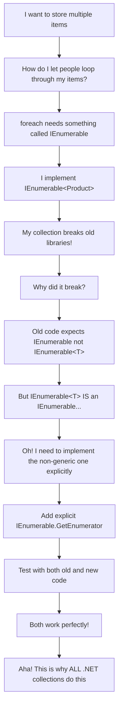
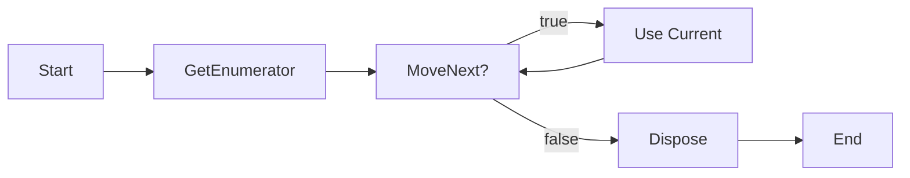
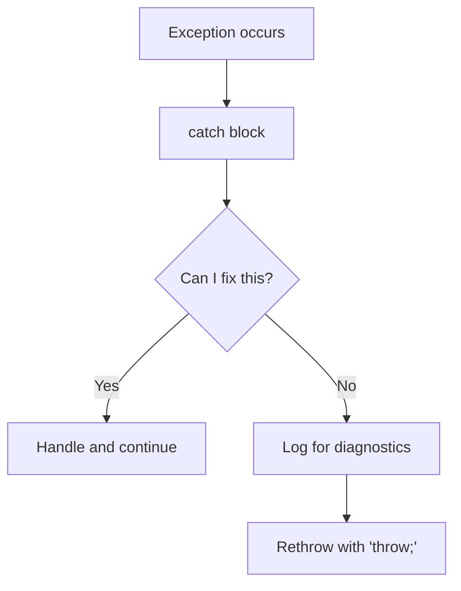

# Microsoft Software and Systems Academy (MSSA)
Cloud Application Development (CAD)

# Daily Digest - 2025-08-26

## 📖 Table of Contents
- [Executive Summary](#executive-summary)
- [Key Concepts](#key-concepts)
  - [1. Implementing Both Generic and Non-Generic Interfaces](#1-implementing-both-generic-and-non-generic-interfaces)
  - [2. Manual Enumerator Control](#2-manual-enumerator-control)
  - [3. Exception Handling Best Practices](#3-exception-handling-best-practices)
  - [4. Resource Management with using Statements](#4-resource-management-with-using-statements)
  - [5. Debug vs Release Builds](#5-debug-vs-release-builds)
  - [6. Environment Variables in VS Code](#6-environment-variables-in-vs-code)
- [Complete Working Example](#complete-working-example)
- [Key Takeaways for ESL Learners](#key-takeaways-for-esl-learners)
- [Professional Development Notes](#professional-development-notes)

## Executive Summary

Today's session focuses on **C# collections, iteration, and error handling**. Learn why .NET collections implement both `IEnumerable<T>` (modern, type-safe) and `IEnumerable` (legacy compatibility). Practice explicit enumeration with `MoveNext()` and `Current`, exception handling with filters and clean rethrowing, resource management with `using` statements, and environment configuration through VS Code launch settings. Compare Debug vs Release build modes for development and production.

**Content Difficulty Levels:**
🟢 Foundation Level  🔵 Intermediate Level  🔴 Advanced Level

> 💡 **Learning Path**: Start with Foundation concepts, then progress to Intermediate. Advanced concepts build on both previous levels.

---

## Key Concepts

### 1. Implementing Both Generic and Non-Generic Interfaces


**Learning Goal**: Build a custom collection that works with both modern and legacy .NET code.

**What Is This?**: .NET collections often implement two interfaces:
- `IEnumerable<T>` - Modern, type-safe version (knows exactly what type of items it contains)  
- `IEnumerable` - Older version that treats all items as `object` type

**Why Both?**: Legacy compatibility. Older libraries and COM interop expect the non-generic version, while modern code prefers the type-safe generic version.

**When You Need This**:
1. Building libraries that must work with both old and new code
2. Creating domain collections (like `ProductCatalog` or `OrderQueue`)
3. Working with frameworks that expect specific interface implementations

#### Key Terms for This Section

**Interface**
- **Learning Definition**: A blueprint that tells a class what methods it must have, but doesn't tell it how to implement them. Think of it like a contract - if you sign it, you must fulfill all the requirements listed, but you decide how to fulfill them. In programming, when a class implements an interface, it promises to provide code for all the methods the interface declares.
- **Official Definition**: An interface defines a contract. Any class, record or struct that implements that contract must provide an implementation of the members defined in the interface.

**Collection**
- **Learning Definition**: A container that holds multiple related items and gives you ways to work with them - add items, remove items, count them, or go through them one by one. Unlike a simple variable that holds one value, a collection is designed to hold many values and provides built-in methods to manage them efficiently.
- **Official Definition**: Collections provide a flexible way to work with groups of objects. The .NET runtime provides many collection types that store and manage groups of related objects.

**Array vs List vs Collection**
- **Learning Definition**: 
  - *Array*: Like a row of numbered lockers - fixed size, you access items by their position number, but you can't add more lockers once created
  - *List*: Like a flexible container that can grow - you can add or remove items, and it automatically makes room as needed
  - *Collection*: The general term for any container that holds multiple items - arrays, lists, queues, stacks are all types of collections
- **Official Definition**: Collections can be classified by element access (by index or key), performance profile (speed of operations), and ability to grow/shrink dynamically.

**Generic**
- **Learning Definition**: A way to write code that works with different types without rewriting the same logic. Instead of writing separate code for a list of strings and a list of numbers, generics let you write one piece of code that works for any type you specify. The `<T>` syntax means "substitute T with whatever type you actually want to use."
- **Official Definition**: Generic collections are strongly typed collections that provide better type safety and performance than their non-generic counterparts.

**Type Safety**
- **Learning Definition**: The compiler's way of preventing you from accidentally mixing incompatible data types. It catches mistakes like trying to add a number to a string before your program runs, rather than letting it crash during execution. This saves debugging time and prevents runtime errors.
- **Official Definition**: C# is a strongly typed language. Every variable you declare has a type known at compile time. The compiler tells you if you're using that type incorrectly.

#### Example: Professional Collection Implementation
```csharp
using System;
using System.Collections;
using System.Collections.Generic;

namespace ECommerce.Domain
{
    public sealed class Product
    {
        public int Id { get; }
        public string Name { get; }
        public decimal Price { get; }

        public Product(int id, string name, decimal price)
        {
            Id = id;
            Name = name ?? throw new ArgumentNullException(nameof(name));
            Price = price;
        }

        public override string ToString() => $"{Name} (${Price:F2})";
    }

    // Collection implementing both interfaces
    public sealed class ProductCatalog : IEnumerable<Product>
    {
        private readonly List<Product> _products = new();

        public void Add(Product product) 
        {
            if (product == null) throw new ArgumentNullException(nameof(product));
            _products.Add(product);
        }

        public int Count => _products.Count;

        // Modern, type-safe enumerator
        public IEnumerator<Product> GetEnumerator() => _products.GetEnumerator();

        // Legacy enumerator (explicit implementation - hidden from IntelliSense)
        IEnumerator IEnumerable.GetEnumerator() => GetEnumerator();
    }
}
```

#### Teaching Flow: The "Aha!" Journey to Understanding Collections


---

### 2. Manual Enumerator Control


**Learning Goal**: Control iteration step-by-step using `IEnumerator<T>` methods.

**What Is This?**: `foreach` automatically handles enumeration. Manual enumeration gives you precise control over when to move to the next item, when to stop, and what to do between items.

**Key Methods**:
- `GetEnumerator()` - Gets the iterator object
- `MoveNext()` - Advances to next item, returns `true` if successful
- `Current` - Gets the current item
- `Dispose()` - Cleans up resources when done

**When You Need This**:
1. Custom traversal patterns (skip every other item, peek ahead, etc.)
2. Comparing two collections element by element
3. Building your own iteration algorithms
4. Debugging enumeration problems

#### Key Terms for This Section

**Enumerator**
- **Learning Definition**: A mechanism that moves through a collection one item at a time, keeping track of where it is and what comes next. Like reading a book page by page - the enumerator remembers which page you're on and can turn to the next page when requested. It provides three main operations: move to the next item, get the current item, and know when you've reached the end.
- **Official Definition**: An object that implements IEnumerator<T> or IEnumerator interface with MoveNext(), Current, and Dispose() methods for traversing collections.

**Iterator**
- **Learning Definition**: A special method that produces items one at a time when requested, using the `yield return` statement. Instead of creating all items at once and storing them in memory, an iterator generates each item only when needed. This is like a factory that makes products on-demand rather than manufacturing everything upfront.
- **Official Definition**: A method that uses a yield return statement to return each element of a collection one at a time, creating a state machine for deferred execution.

**State Machine**
- **Learning Definition**: Code that the compiler automatically generates to remember where an iterator left off between calls. When you pause an iterator (like with `yield return`), the state machine saves the current position, local variables, and execution state. When you call it again, it picks up exactly where it stopped, like pausing a video and resuming later.
- **Official Definition**: Compiler-generated code that maintains execution state and local variables between method calls in iterator implementations.

**Lazy Evaluation**
- **Learning Definition**: A programming technique where work is postponed until the result is actually needed. Instead of doing all calculations immediately, lazy evaluation waits until someone asks for the answer. This saves time and memory when you might not use all the results, like preparing food only when customers order rather than cooking everything in advance.
- **Official Definition**: Deferring computation until the value is requested, commonly used in iterator methods and LINQ operations for performance optimization.

**IDisposable**
- **Learning Definition**: An interface that tells objects how to clean up resources they're using when finished. Objects that implement IDisposable have a Dispose() method that releases things like file handles, database connections, or memory. It's like having a cleanup routine that puts tools away and turns off lights when leaving a workshop.
- **Official Definition**: An interface requiring a Dispose() method for deterministic release of unmanaged resources and cleanup of system resources.

#### Example: Manual Enumeration
```csharp
public static class EnumerationExamples
{
    public static void CompareProductCatalogs(ProductCatalog catalog1, ProductCatalog catalog2)
    {
        using IEnumerator<Product> enum1 = catalog1.GetEnumerator();
        using IEnumerator<Product> enum2 = catalog2.GetEnumerator();

        int position = 0;
        while (enum1.MoveNext() && enum2.MoveNext())
        {
            Product product1 = enum1.Current;
            Product product2 = enum2.Current;
            
            if (product1.Id != product2.Id)
            {
                Console.WriteLine($"Difference at position {position}: {product1.Id} vs {product2.Id}");
            }
            position++;
        }
    }

    public static decimal CalculateTotalWithLogging(ProductCatalog catalog)
    {
        decimal total = 0;
        using IEnumerator<Product> enumerator = catalog.GetEnumerator();
        
        while (enumerator.MoveNext())
        {
            Product current = enumerator.Current;
            total += current.Price;
            Console.WriteLine($"Added ${current.Price:F2}, running total: ${total:F2}");
        }
        
        return total;
    }
}
```

#### Process Flow: Manual Enumeration


---

### 3. Exception Handling Best Practices


**Learning Goal**: Handle errors professionally with logging, filtering, and proper rethrowing.

**What Is This?**: Exception handling is how you deal with unexpected problems. Professional exception handling means:
- Catching only what you can meaningfully handle
- Logging important information
- Rethrowing exceptions correctly to preserve debugging information
- Using specific exception types when possible

**Exception Handling Rules**:
1. **Catch specifically** - `catch (FileNotFoundException)` instead of `catch (Exception)`
2. **Log then rethrow** - Add context, then use `throw;` (not `throw ex;`)
3. **Use filters** - `catch (...) when (condition)` for conditional handling
4. **Clean up resources** - Use `finally` or `using` statements

#### Key Terms for This Section

**Exception**
- **Learning Definition**: An object that represents an error condition that disrupts the normal flow of program execution. When something goes wrong (file not found, network timeout, invalid input), .NET creates an exception object containing details about what happened and where it occurred. Think of it as an emergency alert system that stops normal operations to handle the problem.
- **Official Definition**: An object representing an error condition that disrupts execution, transferred to the nearest matching handler by the runtime's exception handling mechanism.

**Stack Trace**
- **Learning Definition**: A detailed record showing the sequence of method calls that led to an exception, like breadcrumbs showing the path through your code. It lists each method that was called, in reverse order, from where the exception occurred back to where your program started. This helps developers trace exactly how the program got to the point where it failed.
- **Official Definition**: The sequence of method calls leading to an exception, providing debugging information about the execution path and location where the error occurred.

**Exception Filter**
- **Learning Definition**: A condition (using the `when` keyword) that determines whether a specific catch block should handle an exception. It acts like a bouncer at a club - even if the exception type matches, the filter checks additional conditions before deciding to let it into the catch block. This allows precise control over which exceptions to handle versus which ones to let continue up the call stack.
- **Official Definition**: A `when` clause that evaluates a boolean expression at throw time to determine if the associated catch block should handle the exception.

**Rethrowing**
- **Learning Definition**: The practice of passing an exception up to the next level of code after logging or adding context, using `throw;` to preserve all the original error information. It's like forwarding an important message to your supervisor along with your notes, but keeping the original message intact so they can see exactly what happened.
- **Official Definition**: Re-emitting the current exception using `throw;` to preserve the original stack trace and exception details while allowing higher-level handlers to manage it.

**Finally Block**
- **Learning Definition**: Code that always executes after try/catch blocks, regardless of whether an exception occurred or not. It's used for essential cleanup operations like closing files or releasing resources. Think of it as the "always do this on your way out" instruction - no matter how you exit the method (success or failure), the finally code runs.
- **Official Definition**: A block that executes after try/catch for cleanup operations, guaranteed to run regardless of whether exceptions occur or how control flow exits the try block.

**Catch Block**
- **Learning Definition**: Code that handles specific types of exceptions, providing recovery logic or error reporting for problems that occur in the try block. Each catch block can handle a different type of exception, allowing tailored responses - like having different specialists handle different types of emergencies in a hospital.
- **Official Definition**: A block that handles exceptions of a particular type, containing recovery logic and error handling code for specific exception conditions.

#### Example: Professional Exception Handling
```csharp
public static class FileService
{
    public static string LoadConfiguration(string filePath)
    {
        try
        {
            using var reader = new StreamReader(filePath);
            return reader.ReadToEnd();
        }
        catch (FileNotFoundException ex) when (IsOptionalFile(filePath))
        {
            // Handle optional files gracefully
            Console.WriteLine($"Optional configuration file not found: {filePath}");
            return GetDefaultConfiguration();
        }
        catch (UnauthorizedAccessException ex)
        {
            // Add context and rethrow
            Console.Error.WriteLine($"Access denied reading {filePath}: {ex.Message}");
            throw; // Preserves original stack trace
        }
        catch (Exception ex)
        {
            // Log unexpected errors and rethrow
            Console.Error.WriteLine($"Unexpected error reading {filePath}: {ex.GetType().Name} - {ex.Message}");
            throw; // Let higher levels handle it
        }
    }

    private static bool IsOptionalFile(string path) => 
        path.Contains("optional") || path.Contains("config");

    private static string GetDefaultConfiguration() => "{}"; // Empty JSON
}
```

#### Decision Flow: Exception Handling


---

### 4. Resource Management with `using` Statements


**Learning Goal**: Ensure resources are properly cleaned up, even when errors occur.

**What Is This?**: The `using` statement automatically calls `Dispose()` on objects that implement `IDisposable`. This ensures files are closed, network connections are released, and memory is freed properly.

**Two Forms**:
```csharp
// Using statement (creates a scope)
using (var file = new FileStream("data.txt", FileMode.Open))
{
    // Use the file
} // file.Dispose() called here automatically

// Using declaration (C# 8+, disposes at end of method)
using var file = new FileStream("data.txt", FileMode.Open);
// Use the file
// file.Dispose() called when method exits
```

**When You Need This**:
1. Working with files (`FileStream`, `StreamReader`, `StreamWriter`)
2. Database connections (`SqlConnection`, `SqlCommand`)
3. HTTP requests (`HttpClient`, though be careful with disposal timing)
4. Any object implementing `IDisposable`

#### Key Terms for This Section

**Resource**
- **Learning Definition**: Anything your program uses that has limited availability or requires cleanup when finished - like files, database connections, network sockets, or memory allocations. Resources are often managed by the operating system and have costs associated with them. If not properly released, they can cause memory leaks, performance problems, or prevent other programs from accessing needed system components.
- **Official Definition**: System objects like files, memory, network connections, or database handles that require explicit cleanup to prevent resource exhaustion and maintain system stability.

**IDisposable**
- **Learning Definition**: A contract (interface) that objects implement when they use resources that need explicit cleanup. When an object implements IDisposable, it promises to provide a Dispose() method that properly releases any resources it's holding. This ensures predictable cleanup timing rather than waiting for the garbage collector to eventually clean up.
- **Official Definition**: An interface requiring a Dispose() method for deterministic release of unmanaged resources and cleanup of system resources.

**Memory Leak**
- **Learning Definition**: A situation where a program keeps allocating memory or other resources but never releases them, causing the program (and sometimes the entire system) to gradually consume more and more resources until performance degrades or the system runs out of memory. It's like leaving the water running - eventually the sink overflows.
- **Official Definition**: Unreleased resources that remain allocated after they're no longer needed, causing gradual resource exhaustion and performance degradation.

**Deterministic Disposal**
- **Learning Definition**: The ability to release resources at an exact, predictable moment rather than waiting for the garbage collector to clean them up sometime later. Using statements and explicit Dispose() calls provide deterministic disposal - you know exactly when the resource is freed, which is crucial for limited resources like file handles or database connections.
- **Official Definition**: Immediate resource cleanup at a predictable time, as opposed to non-deterministic cleanup performed by the garbage collector.

**Scope**
- **Learning Definition**: The region of code where a variable or resource is accessible and valid. In C#, scope is typically defined by curly braces - when execution leaves the scope (exits the braces), variables declared in that scope are no longer accessible. Using statements create a scope specifically for resource management, automatically disposing resources when the scope ends.
- **Official Definition**: The region of code where an identifier is accessible, typically bounded by block statements and determining variable lifetime and accessibility.

**File Handle**
- **Learning Definition**: The operating system's way of tracking and managing access to an open file. When you open a file, the OS gives your program a handle (like a ticket or reference number) to identify that specific file access session. The OS limits how many file handles are available, so you must close files when done to free up handles for other operations.
- **Official Definition**: An OS resource representing access to a file or device, requiring proper management to prevent handle exhaustion and ensure system stability.

#### Example: Resource Management
```csharp
public static class DataProcessor
{
    public static void ProcessOrderFile(string inputPath, string outputPath)
    {
        // Both files will be properly closed even if exceptions occur
        using var input = new StreamReader(inputPath);
        using var output = new StreamWriter(outputPath);
        
        string line;
        int orderCount = 0;
        
        while ((line = input.ReadLine()) != null)
        {
            if (IsValidOrder(line))
            {
                output.WriteLine($"PROCESSED: {line}");
                orderCount++;
            }
            else
            {
                output.WriteLine($"INVALID: {line}");
            }
        }
        
        output.WriteLine($"Total orders processed: {orderCount}");
        // Files automatically closed here, even if exceptions occurred
    }
    
    private static bool IsValidOrder(string line) => 
        !string.IsNullOrWhiteSpace(line) && line.Contains("ORDER");
}
```

---

### 5. Debug vs Release Builds


**Learning Goal**: Understand when to use each build configuration and how they differ.

**What Is This?**: .NET projects have two main build configurations:
- **Debug**: Includes debugging symbols, disables optimizations, includes extra checks
- **Release**: Optimized for performance, smaller file size, fewer runtime checks

**Key Differences**:
| Debug | Release |
|-------|---------|
| Slower execution | Faster execution |
| Larger files | Smaller files |
| More debugging info | Less debugging info |
| `DEBUG` symbol defined | `RELEASE` symbol defined |
| Better for development | Better for production |

#### Key Terms for This Section

**Build Configuration**
- **Learning Definition**: A set of compiler settings that control how your source code is transformed into executable files. Different configurations optimize for different goals - Debug configuration prioritizes developer experience with symbols and debugging information, while Release configuration optimizes for end-user performance with smaller, faster code. It's like having different modes on a camera for different shooting conditions.
- **Official Definition**: Project settings that determine compiler options, preprocessor symbols, and optimization levels used during the build process.

**Compiler Optimization**
- **Learning Definition**: Automatic improvements the compiler makes to your code to increase performance, reduce memory usage, or decrease file size. These transformations don't change what your code does, but make it run more efficiently. For example, the compiler might eliminate unused variables, inline small methods, or rearrange instructions for better CPU performance.
- **Official Definition**: Transformations applied by the compiler to improve performance, reduce code size, and optimize resource usage without changing program behavior.

**Debug Symbols**
- **Learning Definition**: Additional information embedded in or alongside compiled code that maps the executable instructions back to your original source code. These symbols enable debuggers to show variable names, line numbers, and source code while stepping through a running program. Without debug symbols, debuggers can only show cryptic assembly code.
- **Official Definition**: Metadata mapping compiled code back to source code locations, variable names, and type information for debugging and profiling tools.

**Preprocessor Directives**
- **Learning Definition**: Special instructions (starting with #) that tell the compiler to include or exclude code based on conditions before actual compilation begins. The `#if DEBUG` directive, for example, creates code that only exists in Debug builds. It's like having conditional text in a document that only appears under certain circumstances.
- **Official Definition**: Conditional compilation directives that control which source code sections are included in the compilation based on defined symbols and conditions.

**Binary Size**
- **Learning Definition**: The amount of disk space your compiled program occupies. Debug builds are larger because they include extra debugging information and aren't optimized for size. Release builds are smaller because the compiler removes debugging data and applies optimizations to reduce the final executable size, making distribution and loading faster.
- **Official Definition**: The size of the executable file after compilation, affected by debug information, compiler optimizations, and included resources.

**Runtime Performance**
- **Learning Definition**: How efficiently your program executes when users run it - including speed of execution, memory usage, and resource consumption. Release builds typically perform better because the compiler applies optimizations like eliminating redundant code, improving memory access patterns, and choosing more efficient instruction sequences.
- **Official Definition**: Execution speed, memory usage, and resource consumption characteristics during program execution, influenced by compiler optimizations and build configuration.

#### Example: Conditional Compilation
```csharp
public static class DiagnosticHelper
{
    public static void LogDebugInfo(string message)
    {
#if DEBUG
        Console.WriteLine($"[DEBUG {DateTime.Now:HH:mm:ss}] {message}");
        System.Diagnostics.Debug.WriteLine(message);
#endif
        // In Release builds, this method does nothing
    }

    public static void ValidateExpensiveCondition()
    {
#if DEBUG
        // Expensive validation only in debug builds
        if (SomeExpensiveCheck())
        {
            throw new InvalidOperationException("Debug-only validation failed");
        }
#endif
    }

    private static bool SomeExpensiveCheck() => true; // Placeholder
}
```

#### Build Commands
```bash
# Build for development (includes debugging symbols)
dotnet build -c Debug

# Build for production (optimized, smaller)
dotnet build -c Release

# Run in specific configuration
dotnet run -c Debug
dotnet run -c Release
```

---

### 6. Environment Variables in VS Code


**Learning Goal**: Configure your application behavior without changing code.

**What Is This?**: Environment variables let you change how your program behaves without modifying the source code. This is essential for:
- Different settings for development vs production
- Storing sensitive information (API keys, connection strings)
- Feature flags and configuration options

#### Key Terms for This Section

**Environment Variable**
- **Learning Definition**: A named value that your program can read at runtime to change its behavior without modifying the source code. Environment variables are set outside your program (by the operating system, development tools, or deployment scripts) and accessed using methods like `Environment.GetEnvironmentVariable()`. This allows the same program to behave differently in development, testing, and production environments.
- **Official Definition**: A key-value pair available to processes at runtime, used for configuration and runtime parameter passing without requiring code changes.

**Configuration**
- **Learning Definition**: External settings that control how your application behaves, stored separately from your code in files, environment variables, or databases. Configuration allows you to change program behavior (API endpoints, feature flags, connection strings) without recompiling or redistributing your application. This separation is essential for deploying the same code across different environments.
- **Official Definition**: External parameters that modify program behavior without requiring code changes, typically stored in configuration files, environment variables, or external configuration services.

**JSON (JavaScript Object Notation)**
- **Learning Definition**: A text format for storing and exchanging structured data using key-value pairs, arrays, and nested objects. Despite its name, JSON is language-independent and widely used for configuration files, API responses, and data storage. It's human-readable and easy for programs to parse, making it ideal for configuration files where both humans and programs need to read the data.
- **Official Definition**: A lightweight, text-based data interchange format using key-value pairs and arrays, widely adopted for configuration, API communication, and data serialization.

**API Key**
- **Learning Definition**: A unique secret identifier that proves your application is authorized to access an external service or API. Like a membership card or password, API keys authenticate your requests and often control access limits, billing, or feature availability. They must be kept secure and typically stored in environment variables rather than source code to prevent unauthorized use.
- **Official Definition**: A unique identifier used to authenticate and authorize requests to an API, typically kept secret and used for access control and usage tracking.

**Feature Flag**
- **Learning Definition**: A configuration setting that enables or disables specific functionality in your application without deploying new code. Feature flags allow you to turn features on or off for different users, environments, or conditions. This enables safe rollouts, A/B testing, and the ability to quickly disable problematic features without code changes.
- **Official Definition**: A configuration-driven toggle that controls the availability of application features, enabling runtime feature management and gradual rollouts.

**Development vs Production**
- **Learning Definition**: Different environments where your application runs, each with distinct purposes and configurations. Development is your local environment optimized for coding and debugging, with detailed logging and debugging tools enabled. Production is the live environment where real users access your application, optimized for performance, security, and stability with minimal diagnostic overhead.
- **Official Definition**: Separate deployment environments with different configurations - development optimized for debugging and rapid iteration, production optimized for performance, security, and user experience.

#### VS Code Configuration (`.vscode/launch.json`)
```json
{
    "version": "0.2.0",
    "configurations": [
        {
            "name": ".NET Core Launch (console)",
            "type": "coreclr",
            "request": "launch",
            "program": "${workspaceFolder}/bin/Debug/net8.0/YourApp.dll",
            "args": [],
            "cwd": "${workspaceFolder}",
            "console": "integratedTerminal",
            "env": {
                "APP_ENVIRONMENT": "Development",
                "API_BASE_URL": "https://api-dev.example.com",
                "LOG_LEVEL": "Debug",
                "FEATURE_ENHANCED_LOGGING": "true"
            }
        }
    ]
}
```

#### Using Environment Variables in Code
```csharp
public static class AppConfiguration
{
    public static void DisplayConfiguration()
    {
        string environment = Environment.GetEnvironmentVariable("APP_ENVIRONMENT") ?? "Production";
        string apiUrl = Environment.GetEnvironmentVariable("API_BASE_URL") ?? "https://api.example.com";
        string logLevel = Environment.GetEnvironmentVariable("LOG_LEVEL") ?? "Info";
        bool enhancedLogging = Environment.GetEnvironmentVariable("FEATURE_ENHANCED_LOGGING") == "true";

        Console.WriteLine($"Environment: {environment}");
        Console.WriteLine($"API URL: {apiUrl}");
        Console.WriteLine($"Log Level: {logLevel}");
        Console.WriteLine($"Enhanced Logging: {(enhancedLogging ? "Enabled" : "Disabled")}");

        if (enhancedLogging)
        {
            Console.WriteLine("[ENHANCED] Additional diagnostic information available");
        }
    }
}
```

---

## Complete Working Example

Here's a complete console application demonstrating all concepts:

```csharp
using System;
using System.Collections;
using System.Collections.Generic;
using System.IO;

namespace MssaCadDaily
{
    // Domain entity
    public sealed class Order
    {
        public int Id { get; }
        public string CustomerName { get; }
        public decimal Amount { get; }

        public Order(int id, string customerName, decimal amount)
        {
            Id = id;
            CustomerName = customerName ?? throw new ArgumentNullException(nameof(customerName));
            Amount = amount;
        }

        public override string ToString() => $"Order #{Id}: {CustomerName} - ${Amount:F2}";
    }

    // Custom collection implementing both interfaces
    public sealed class OrderQueue : IEnumerable<Order>
    {
        private readonly List<Order> _orders = new();

        public void Add(Order order) => _orders.Add(order);
        public int Count => _orders.Count;

        // Generic enumerator (type-safe)
        public IEnumerator<Order> GetEnumerator() => _orders.GetEnumerator();

        // Non-generic enumerator (legacy compatibility)
        IEnumerator IEnumerable.GetEnumerator() => GetEnumerator();
    }

    public static class Program
    {
        public static void Main()
        {
            Console.WriteLine("=== MSSA CAD Daily Digest Demo ===");
            
            // Display configuration from environment variables
            DisplayEnvironmentConfiguration();
            
            // Create and populate order queue
            var orders = CreateSampleOrders();
            
            // Demonstrate automatic enumeration (foreach)
            Console.WriteLine("\n--- Automatic Enumeration (foreach) ---");
            foreach (var order in orders)
            {
                Console.WriteLine(order);
            }
            
            // Demonstrate manual enumeration
            Console.WriteLine("\n--- Manual Enumeration (IEnumerator<T>) ---");
            DemonstrateManualEnumeration(orders);
            
            // Demonstrate exception handling
            Console.WriteLine("\n--- Exception Handling ---");
            DemonstrateExceptionHandling();
            
            // Demonstrate resource management
            Console.WriteLine("\n--- Resource Management ---");
            DemonstrateResourceManagement();
            
            Console.WriteLine("\n=== Demo Complete ===");
        }

        private static void DisplayEnvironmentConfiguration()
        {
            string environment = Environment.GetEnvironmentVariable("APP_ENVIRONMENT") ?? "Production";
            string logLevel = Environment.GetEnvironmentVariable("LOG_LEVEL") ?? "Info";
            
            Console.WriteLine($"Environment: {environment}");
            Console.WriteLine($"Log Level: {logLevel}");
            
#if DEBUG
            Console.WriteLine("Build: DEBUG (development mode)");
#else
            Console.WriteLine("Build: RELEASE (production mode)");
#endif
        }

        private static OrderQueue CreateSampleOrders()
        {
            var orders = new OrderQueue();
            orders.Add(new Order(1, "Alice Johnson", 99.99m));
            orders.Add(new Order(2, "Bob Smith", 149.50m));
            orders.Add(new Order(3, "Carol Davis", 79.25m));
            return orders;
        }

        private static void DemonstrateManualEnumeration(OrderQueue orders)
        {
            decimal total = 0;
            int count = 0;
            
            using IEnumerator<Order> enumerator = orders.GetEnumerator();
            while (enumerator.MoveNext())
            {
                Order current = enumerator.Current;
                total += current.Amount;
                count++;
                Console.WriteLine($"Processing {current} (Running total: ${total:F2})");
            }
            
            Console.WriteLine($"Processed {count} orders, total value: ${total:F2}");
        }

        private static void DemonstrateExceptionHandling()
        {
            try
            {
                ReadConfigFile("optional-settings.json");
            }
            catch (FileNotFoundException ex) when (ex.FileName?.Contains("optional") == true)
            {
                Console.WriteLine($"Optional configuration file not found: {ex.FileName}");
                Console.WriteLine("Using default settings instead.");
            }
            catch (Exception ex)
            {
                Console.Error.WriteLine($"Unexpected error: {ex.GetType().Name} - {ex.Message}");
                throw; // Rethrow to preserve stack trace
            }
        }

        private static void ReadConfigFile(string fileName)
        {
            // This will throw FileNotFoundException for demonstration
            using var reader = new StreamReader(fileName);
            Console.WriteLine(reader.ReadToEnd());
        }

        private static void DemonstrateResourceManagement()
        {
            string tempFile = "demo-output.txt";
            
            // Using statement ensures file is properly closed
            using (var writer = new StreamWriter(tempFile))
            {
                writer.WriteLine("This file demonstrates resource management.");
                writer.WriteLine("The StreamWriter will be disposed automatically.");
                writer.WriteLine($"Created at: {DateTime.Now:yyyy-MM-dd HH:mm:ss}");
            } // writer.Dispose() called here automatically
            
            Console.WriteLine($"Successfully wrote to {tempFile}");
            
            // Clean up the demo file
            if (File.Exists(tempFile))
            {
                File.Delete(tempFile);
                Console.WriteLine("Demo file cleaned up.");
            }
        }
    }
}
```

---

## Key Takeaways for ESL Learners

### Essential Vocabulary
- **Enumeration** = Going through items one by one
- **Iterator** = A tool that moves through a collection
- **Exception** = An error that interrupts normal program flow
- **Resource** = Something your program uses (files, memory, connections)
- **Dispose** = Clean up and free resources
- **Rethrow** = Pass an exception up to the next level

### Success Patterns
1. **Always use `using` for `IDisposable` objects** - Files, database connections, HTTP clients
2. **Implement both interfaces for collections** - Modern code gets type safety, legacy code still works
3. **Catch specific exceptions first** - Handle what you can, log and rethrow the rest
4. **Use environment variables for configuration** - Keep secrets and settings out of source code
5. **Debug builds for development, Release for production** - Each serves a different purpose

### Common Mistakes to Avoid
- Don't use `throw ex;` - use `throw;` to preserve stack traces
- Don't forget to dispose resources - use `using` statements
- Don't catch `Exception` unless you're logging and rethrowing
- Don't hardcode configuration values - use environment variables
- Don't ship Debug builds to production - always use Release

---

## Professional Development Notes

**For Interviews**: Be prepared to explain why you implement both `IEnumerable<T>` and `IEnumerable`, how `using` statements work under the hood, and the difference between Debug and Release builds.

**For Code Reviews**: Reviewers will look for proper exception handling (specific catches, clean rethrowing), resource management (using statements), and appropriate use of manual enumeration when `foreach` isn't sufficient.

**For Production Systems**: Environment variables, proper exception logging, and Release builds are essential for maintainable, deployable applications.

This digest provides runnable examples you can discuss confidently in technical interviews and apply immediately in professional development work.
