# Microsoft Software and Systems Academy (MSSA)
## Cloud Application Development (CAD) - CCAD19 20250826
### Personal Learning Notes: Collection Architecture Fundamentals

---

## 🎯 Executive Summary
**Core Focus:** Understanding the architectural relationship between generic and non-generic collection interfaces in C#. This module covers why .NET requires implementing both `IEnumerable<T>` and `IEnumerable`, how enumerators provide controlled iteration, and the performance implications for cloud applications. **Key Professional Insight:** Mastering these patterns is essential for building scalable, memory-efficient applications that integrate seamlessly with LINQ and foreach operations.

---

## 📚 Table of Contents
1. [Collection Architecture Fundamentals](#1-collection-architecture-fundamentals)
2. [Manual Enumerator Control Patterns](#2-manual-enumerator-control-patterns)
3. [Production-Ready Implementation](#3-production-ready-implementation)
4. [Performance & Memory Considerations](#4-performance--memory-considerations)
5. [Integration Patterns](#5-integration-patterns)

---

## 1️⃣ Collection Architecture Fundamentals

### Learning Objective
This section explains the dual-interface requirement in .NET collections and how to leverage manual enumerator control for performance-critical scenarios. Understanding these patterns will prevent common enumeration bugs and enable efficient data processing in enterprise applications.

### 1.1 Technical Definitions & Expanded Concepts

**Important Note:** Throughout this guide, **`IEnumerable<T>`** and **`IEnumerable of T`** refer to the same generic interface - both notations are used interchangeably to accommodate different documentation styles.

#### **Collection**
- **Technical Definition:** A data structure implementing `IEnumerable<T>` that provides sequential access to a group of related objects
- **Plain Language:** A container that holds multiple items and knows how to let you visit each item one by one
- **Professional Context:** Foundation of .NET's unified collection model, enabling LINQ, foreach, and async enumeration

#### **Enumerator** 
- **Technical Definition:** A stateful iterator implementing `IEnumerator<T>` that maintains current position and provides controlled traversal through a collection
- **Plain Language:** Like a bookmark that remembers where you are in a book and can move to the next page
- **Professional Context:** Enables deferred execution patterns crucial for memory-efficient data processing

#### **Generic Interface (`IEnumerable<T>`)**
- **Technical Definition:** Type-safe enumeration interface introduced in .NET 2.0 that provides compile-time type checking
- **Plain Language:** A contract that says "I contain items of a specific type (like strings or numbers)"
- **Professional Context:** Enables LINQ operations and prevents boxing/unboxing performance penalties

#### **Non-Generic Interface (`IEnumerable`)**
- **Technical Definition:** Legacy enumeration interface from .NET 1.0 that works with `System.Object`
- **Plain Language:** The older way of saying "I contain items, but you'll need to check what type they are"  
- **Professional Context:** Required for backward compatibility with legacy code and COM interop

#### **MoveNext() Method**
- **Technical Definition:** Advances the enumerator to the next element and returns boolean indicating success
- **Plain Language:** "Move my bookmark to the next item. Tell me true if there IS a next item, false if I've reached the end"
- **Professional Context:** Core of iteration logic - understanding this enables custom enumeration scenarios

#### **Current Property**
- **Technical Definition:** Gets the element at the current position without advancing the enumerator
- **Plain Language:** "What item is my bookmark pointing to right now?"
- **Professional Context:** Provides read access to current element; throws exceptions when called inappropriately

#### **Reset() Method**  
- **Technical Definition:** Sets the enumerator to its initial position before the first element
- **Plain Language:** "Move my bookmark back to the very beginning, before the first page"
- **Professional Context:** Often not implemented; most enumerators are forward-only for performance

#### **Dispose() Method**
- **Technical Definition:** Releases unmanaged resources held by the enumerator
- **Plain Language:** "Clean up and release any resources I was using"
- **Professional Context:** Critical for preventing memory leaks, especially with database or file-based enumerators

### 1.2 Architectural Relationship Visualization

```mermaid
graph TB
    subgraph "🏗️ .NET Collection Architecture"
        Legacy[🕰️ IEnumerable<br/>Legacy Interface]:::legacyColor
        Modern[✨ IEnumerable of T<br/>Generic Interface]:::modernColor
        Implementation[🎯 Your Collection Class<br/>Must Implement Both]:::implColor
    end
    
    subgraph "📋 Interface Requirements"
        LegacyMethods[📝 Non-Generic Methods<br/>GetEnumerator returns IEnumerator]:::legacyColor
        ModernMethods[📝 Generic Methods<br/>GetEnumerator returns IEnumerator of T]:::modernColor
    end
    
    subgraph "🔄 Enumerator Instances"
        LegacyEnum[🔄 IEnumerator<br/>Returns object type]:::legacyColor
        ModernEnum[🔄 IEnumerator of T<br/>Returns specific type]:::modernColor
    end
    
    Legacy --> Implementation
    Modern --> Implementation
    Modern --> Legacy
    Implementation --> LegacyMethods
    Implementation --> ModernMethods
    LegacyMethods --> LegacyEnum
    ModernMethods --> ModernEnum
    
    classDef legacyColor fill:#ff6b6b,stroke:#e63946,stroke-width:2px,color:#fff
    classDef modernColor fill:#51cf66,stroke:#40c057,stroke-width:2px,color:#fff
    classDef implColor fill:#74b9ff,stroke:#0984e3,stroke-width:2px,color:#fff
```



### 1.3 Why Both Interfaces? - Historical Context


### 1.4 Developer Pain Points & Executable Solutions

#### Common Mistake 1: Assuming All Collections Support Indexing

**Wrong Assumption:** "If I can iterate through it with foreach, I can access it with collection[index]"

```csharp
// BAD: This will compile but crash at runtime
using System;
using System.Collections.Generic;

class BadIndexingExample
{
    static void Main()
    {
        var hashSet = new HashSet<string> { "Dune", "1984", "Holes" };
        
        // This compiles but CRASHES - HashSet doesn't support indexing
        try
        {
            Console.WriteLine(hashSet[0]); // Runtime Error!
        }
        catch (Exception ex)
        {
            Console.WriteLine($"Error: {ex.Message}");
        }
    }
}
```

```csharp
// GOOD: Use enumeration for collections that don't support indexing
using System;
using System.Collections.Generic;
using System.Linq;

class GoodEnumerationExample
{
    static void Main()
    {
        var hashSet = new HashSet<string> { "Dune", "1984", "Holes" };
        
        // Correct: Use enumeration methods
        Console.WriteLine($"First book: {hashSet.First()}");
        
        // Or iterate properly
        foreach (var book in hashSet)
        {
            Console.WriteLine($"Book: {book}");
        }
    }
}
```

#### Common Mistake 2: Creating Enumerators Without Proper Disposal

**Wrong Assumption:** "Enumerators clean themselves up automatically"

```csharp
// BAD: Memory leak potential
using System;
using System.Collections.Generic;

class BadEnumeratorManagement
{
    static void Main()
    {
        var books = new List<string> { "Dune", "1984", "Holes" };
        
        // Dangerous: No disposal
        var enumerator = books.GetEnumerator();
        while (enumerator.MoveNext())
        {
            Console.WriteLine(enumerator.Current);
        }
        // Missing: enumerator.Dispose(); - Potential memory leak!
    }
}
```

```csharp
// GOOD: Proper resource management
using System;
using System.Collections.Generic;

class GoodEnumeratorManagement
{
    static void Main()
    {
        var books = new List<string> { "Dune", "1984", "Holes" };
        
        // Method 1: Manual disposal
        using (var enumerator = books.GetEnumerator())
        {
            while (enumerator.MoveNext())
            {
                Console.WriteLine(enumerator.Current);
            }
        } // Automatic disposal here
        
        // Method 2: Let foreach handle it
        foreach (var book in books)
        {
            Console.WriteLine(book); // foreach handles disposal automatically
        }
    }
}
```

#### Common Mistake 3: Multiple Enumeration Performance Killer

**Wrong Assumption:** "LINQ operations are always fast"

```csharp
// BAD: Multiple enumeration performance killer
using System;
using System.Collections.Generic;
using System.Linq;

class BadMultipleEnumeration
{
    static void Main()
    {
        var expensiveQuery = GetBooksFromDatabase().Where(b => b.Length > 4);
        
        // Each of these calls re-executes the database query!
        Console.WriteLine($"Count: {expensiveQuery.Count()}");           // Database hit 1
        Console.WriteLine($"First: {expensiveQuery.First()}");           // Database hit 2  
        Console.WriteLine($"Any long titles: {expensiveQuery.Any()}");   // Database hit 3
    }
    
    static IEnumerable<string> GetBooksFromDatabase()
    {
        Console.WriteLine("Expensive database call executed!");
        return new[] { "Dune", "1984", "Holes", "Foundation" };
    }
}
```

```csharp
// GOOD: Enumerate once, use multiple times
using System;
using System.Collections.Generic;
using System.Linq;

class GoodSingleEnumeration
{
    static void Main()
    {
        // Materialize the query once
        var books = GetBooksFromDatabase().Where(b => b.Length > 4).ToList();
        
        // Now these operations use the cached results
        Console.WriteLine($"Count: {books.Count}");           // No database hit
        Console.WriteLine($"First: {books.First()}");         // No database hit
        Console.WriteLine($"Any long titles: {books.Any()}"); // No database hit
    }
    
    static IEnumerable<string> GetBooksFromDatabase()
    {
        Console.WriteLine("Expensive database call executed!");
        return new[] { "Dune", "1984", "Holes", "Foundation" };
    }
}
```

### 1.5 Memory & Performance Insights

#### **When to Use Collections vs Arrays:**

```mermaid
graph LR
    subgraph "🎯 Use Collections When"
        A[📊 Unknown Size<br/>Dynamic Growth]:::collectionColor
        B[🔄 Sequential Processing<br/>Foreach/LINQ]:::collectionColor
        C[🧠 Memory Conscious<br/>Large Datasets]:::collectionColor
    end
    
    subgraph "🎯 Use Arrays When"
        D[⚡ Known Size<br/>Fixed Length]:::arrayColor
        E[🎲 Random Access<br/>Index-based lookups]:::arrayColor
        F[🚀 Performance Critical<br/>Tight loops]:::arrayColor
    end
    
    classDef collectionColor fill:#51cf66,stroke:#40c057,stroke-width:2px,color:#fff
    classDef arrayColor fill:#74b9ff,stroke:#0984e3,stroke-width:2px,color:#fff
```



#### **Memory Efficiency Pattern:**
- **Enumerators:** Load one item at a time (constant memory)
- **ToList/ToArray:** Load entire collection into memory (variable memory)
- **Cloud Impact:** In Azure/AWS, memory usage directly affects costs

---

## 🔄 Visual Learning: Step-by-Step Enumeration

### The Enumerator Journey - Visual Walkthrough

using System;
using System.Collections.Generic;

namespace EnumeratorVisualization
{
  class Program
  {
    static void Main(string[] args)
    {
      Console.WriteLine("ENUMERATOR STEP-BY-STEP VISUALIZATION");
      Console.WriteLine("=====================================");
      Console.WriteLine();

      // Step 1: Create the collection
      Console.WriteLine("Step 0: Initialize Collection");
      Console.WriteLine("-----------------------------");
      var books = new List<string> { "Dune", "1984", "Holes" };
      Console.WriteLine("Collection: books = [\"Dune\", \"1984\", \"Holes\"]");
      Console.WriteLine("Collection Count: " + books.Count);
      Console.WriteLine();

      // Step 2: Create Enumerator
      Console.WriteLine("Step 1: Create Enumerator");
      Console.WriteLine("-------------------------");
      var enumerator = books.GetEnumerator();
      Console.WriteLine("var enumerator = books.GetEnumerator();");
      Console.WriteLine("Position: BEFORE first element");
      Console.WriteLine("Status: Ready to move");
      Console.WriteLine("Current: INVALID (calling Current now would throw exception)");

      // Demonstrate that Current is invalid before first MoveNext
      try
      {
        var invalidAccess = enumerator.Current;
        Console.WriteLine("Current value: " + invalidAccess);
      }
      catch (InvalidOperationException ex)
      {
        Console.WriteLine("Attempting to access Current: EXCEPTION - " + ex.Message);
      }
      Console.WriteLine();

      // Step 3: First MoveNext()
      Console.WriteLine("Step 2: First MoveNext()");
      Console.WriteLine("------------------------");
      bool moveResult1 = enumerator.MoveNext();
      Console.WriteLine("enumerator.MoveNext() returned: " + moveResult1);
      Console.WriteLine("Position: At element 0 (first element)");
      Console.WriteLine("Current: \"" + enumerator.Current + "\"");
      Console.WriteLine("Status: Successfully moved to first element");
      Console.WriteLine();

      // Step 4: Second MoveNext()
      Console.WriteLine("Step 3: Second MoveNext()");
      Console.WriteLine("-------------------------");
      bool moveResult2 = enumerator.MoveNext();
      Console.WriteLine("enumerator.MoveNext() returned: " + moveResult2);
      Console.WriteLine("Position: At element 1 (second element)");
      Console.WriteLine("Current: \"" + enumerator.Current + "\"");
      Console.WriteLine("Status: Successfully moved to second element");
      Console.WriteLine();

      // Step 5: Third MoveNext()
      Console.WriteLine("Step 4: Third MoveNext()");
      Console.WriteLine("------------------------");
      bool moveResult3 = enumerator.MoveNext();
      Console.WriteLine("enumerator.MoveNext() returned: " + moveResult3);
      Console.WriteLine("Position: At element 2 (third element)");
      Console.WriteLine("Current: \"" + enumerator.Current + "\"");
      Console.WriteLine("Status: Successfully moved to third element");
      Console.WriteLine();

      // Step 6: Fourth MoveNext() - This should return false
      Console.WriteLine("Step 5: Fourth MoveNext() - Attempting to move past end");
      Console.WriteLine("-------------------------------------------------------");
      bool moveResult4 = enumerator.MoveNext();
      Console.WriteLine("enumerator.MoveNext() returned: " + moveResult4);
      Console.WriteLine("Position: AFTER last element (end of collection)");
      Console.WriteLine("Status: No more elements available");

      // Demonstrate that Current is now invalid
      try
      {
        Console.WriteLine("Attempting to access Current: \"" + enumerator.Current + "\"");
      }
      catch (InvalidOperationException ex)
      {
        Console.WriteLine("Attempting to access Current: EXCEPTION - " + ex.Message);
      }
      Console.WriteLine();

      // Step 7: Cleanup
      Console.WriteLine("Step 6: Cleanup");
      Console.WriteLine("---------------");
      Console.WriteLine("Calling enumerator.Dispose()...");
      enumerator.Dispose();
      Console.WriteLine("Resources: Released successfully");
      Console.WriteLine("Enumerator is now disposed and cannot be used");
      Console.WriteLine();

      // Demonstrate that enumerator is now disposed
      try
      {
        enumerator.MoveNext();
      }
      catch (ObjectDisposedException ex)
      {
        Console.WriteLine("Attempting to use disposed enumerator: EXCEPTION - " + ex.Message);
      }

      Console.WriteLine();
      Console.WriteLine("SUMMARY OF ENUMERATOR LIFECYCLE:");
      Console.WriteLine("================================");
      Console.WriteLine("1. Created -> Position: BEFORE first element");
      Console.WriteLine("2. First MoveNext() -> Position: element 0, Current: \"Dune\"");
      Console.WriteLine("3. Second MoveNext() -> Position: element 1, Current: \"1984\"");
      Console.WriteLine("4. Third MoveNext() -> Position: element 2, Current: \"Holes\"");
      Console.WriteLine("5. Fourth MoveNext() -> Position: AFTER last, returned false");
      Console.WriteLine("6. Disposed -> Cannot be used anymore");

      Console.WriteLine();
      Console.WriteLine("COMPARISON: How foreach works internally");
      Console.WriteLine("========================================");
      DemonstrateForeachEquivalent(books);

      Console.WriteLine();
      Console.WriteLine("Press any key to exit...");
      Console.ReadKey();
    }

    static void DemonstrateForeachEquivalent(List<string> books)
    {
      Console.WriteLine("This foreach loop:");
      Console.WriteLine("foreach (var book in books) { Console.WriteLine(book); }");
      Console.WriteLine();
      Console.WriteLine("Is equivalent to this manual enumerator code:");
      Console.WriteLine();

      using (var enumerator = books.GetEnumerator())
      {
        int stepNumber = 1;
        Console.WriteLine("using (var enumerator = books.GetEnumerator())");
        Console.WriteLine("{");

        while (enumerator.MoveNext())
        {
          Console.WriteLine($"    // Step {stepNumber}: MoveNext() returned true");
          Console.WriteLine($"    // Current element: \"{enumerator.Current}\"");
          Console.WriteLine($"    Console.WriteLine(\"{enumerator.Current}\");");
          stepNumber++;
        }

        Console.WriteLine($"    // Step {stepNumber}: MoveNext() returned false - exit while loop");
        Console.WriteLine("}");
        Console.WriteLine("// using statement automatically calls Dispose() here");
      }
    }
  }
}

/*
EXPECTED OUTPUT:

ENUMERATOR STEP-BY-STEP VISUALIZATION
=====================================

Step 0: Initialize Collection
-----------------------------
Collection: books = ["Dune", "1984", "Holes"]
Collection Count: 3

Step 1: Create Enumerator
-------------------------
var enumerator = books.GetEnumerator();
Position: BEFORE first element
Status: Ready to move
Current: INVALID (calling Current now would throw exception)
Attempting to access Current: EXCEPTION - Enumeration has not started. Call MoveNext.

Step 2: First MoveNext()
------------------------
enumerator.MoveNext() returned: True
Position: At element 0 (first element)
Current: "Dune"
Status: Successfully moved to first element

Step 3: Second MoveNext()
-------------------------
enumerator.MoveNext() returned: True
Position: At element 1 (second element)
Current: "1984"
Status: Successfully moved to second element

Step 4: Third MoveNext()
------------------------
enumerator.MoveNext() returned: True
Position: At element 2 (third element)
Current: "Holes"
Status: Successfully moved to third element

Step 5: Fourth MoveNext() - Attempting to move past end
-------------------------------------------------------
enumerator.MoveNext() returned: False
Position: AFTER last element (end of collection)
Status: No more elements available
Attempting to access Current: EXCEPTION - Enumeration has already finished.

Step 6: Cleanup
---------------
Calling enumerator.Dispose()...
Resources: Released successfully
Enumerator is now disposed and cannot be used

Attempting to use disposed enumerator: EXCEPTION - Cannot access a disposed object.

SUMMARY OF ENUMERATOR LIFECYCLE:
================================
1. Created -> Position: BEFORE first element
2. First MoveNext() -> Position: element 0, Current: "Dune"
3. Second MoveNext() -> Position: element 1, Current: "1984"
4. Third MoveNext() -> Position: element 2, Current: "Holes"
5. Fourth MoveNext() -> Position: AFTER last, returned false
6. Disposed -> Cannot be used anymore

COMPARISON: How foreach works internally
========================================
This foreach loop:
foreach (var book in books) { Console.WriteLine(book); }

Is equivalent to this manual enumerator code:

using (var enumerator = books.GetEnumerator())
{
    // Step 1: MoveNext() returned true
    // Current element: "Dune"
    Console.WriteLine("Dune");
    // Step 2: MoveNext() returned true
    // Current element: "1984"
    Console.WriteLine("1984");
    // Step 3: MoveNext() returned true
    // Current element: "Holes"
    Console.WriteLine("Holes");
    // Step 4: MoveNext() returned false - exit while loop
}
// using statement automatically calls Dispose() here

Press any key to exit...
*/
