# Microsoft Software and Systems Academy (MSSA)
## Cloud Application Development (CAD) - CCAD19 20250826
### Personal Learning Notes: Collection Architecture Fundamentals

---

## Learning Objectives
After completing this module, you'll be able to:
* Distinguish between generic IEnumerable<T> and non-generic IEnumerable interfaces and explain why both must be implemented in custom collections.
* Create and control enumerators manually using MoveNext(), Current, and proper disposal patterns.
* Implement proper resource management for enumerators using 'using' statements and understanding automatic disposal in foreach loops.
* Identify performance implications of multiple enumeration versus single materialization in LINQ operations.
* Debug common enumerator usage errors including premature Current access and missing disposal.
* Compare sequential enumeration patterns with random access indexing and select appropriate approaches for different collection types.
* Apply enumerator concepts to build memory-efficient data processing solutions for cloud applications.

---

## 🎯 Executive Summary
**Core Focus:** Understanding the architectural relationship between generic and non-generic collection interfaces in C#. This module covers why .NET requires implementing both `IEnumerable<T>` and `IEnumerable`, how enumerators provide controlled iteration, and the performance implications for cloud applications. **Key Professional Insight:** Mastering these patterns is essential for building scalable, memory-efficient applications that integrate seamlessly with LINQ and foreach operations.

---

## 📚 Table of Contents
1. [Collection Architecture Fundamentals](#1-collection-architecture-fundamentals)
2. [Manual Enumerator Control Patterns](#2-manual-enumerator-control-patterns)
3. [Production-Ready Implementation](#3-production-ready-implementation)
4. [Performance & Memory Considerations](#4-performance--memory-considerations)
5. [Integration Patterns](#5-integration-patterns)

---

## 1️⃣ Collection Architecture Fundamentals

### Learning Objective
This section explains the dual-interface requirement in .NET collections and how to leverage manual enumerator control for performance-critical scenarios. Understanding these patterns will prevent common enumeration bugs and enable efficient data processing in enterprise applications.

### 1.1 Technical Definitions & Expanded Concepts

**Important Note:** Throughout this guide, **`IEnumerable<T>`** and **`IEnumerable of T`** refer to the same generic interface - both notations are used interchangeably to accommodate different documentation styles.

#### **Collection**
- **Technical Definition:** A data structure implementing `IEnumerable<T>` that provides sequential access to a group of related objects
- **Plain Language:** A container that holds multiple items and knows how to let you visit each item one by one
- **Professional Context:** Foundation of .NET's unified collection model, enabling LINQ, foreach, and async enumeration

#### **Enumerator** 
- **Technical Definition:** A stateful iterator implementing `IEnumerator<T>` that maintains current position and provides controlled traversal through a collection
- **Plain Language:** Like a bookmark that remembers where you are in a book and can move to the next page
- **Professional Context:** Enables deferred execution patterns crucial for memory-efficient data processing

#### **Generic Interface (`IEnumerable<T>`)**
- **Technical Definition:** Type-safe enumeration interface introduced in .NET 2.0 that provides compile-time type checking
- **Plain Language:** A contract that says "I contain items of a specific type (like strings or numbers)"
- **Professional Context:** Enables LINQ operations and prevents boxing/unboxing performance penalties

#### **Non-Generic Interface (`IEnumerable`)**
- **Technical Definition:** Legacy enumeration interface from .NET 1.0 that works with `System.Object`
- **Plain Language:** The older way of saying "I contain items, but you'll need to check what type they are"  
- **Professional Context:** Required for backward compatibility with legacy code and COM interop

#### **MoveNext() Method**
- **Technical Definition:** Advances the enumerator to the next element and returns boolean indicating success
- **Plain Language:** "Move my bookmark to the next item. Tell me true if there IS a next item, false if I've reached the end"
- **Professional Context:** Core of iteration logic - understanding this enables custom enumeration scenarios

#### **Current Property**
- **Technical Definition:** Gets the element at the current position without advancing the enumerator
- **Plain Language:** "What item is my bookmark pointing to right now?"
- **Professional Context:** Provides read access to current element; throws exceptions when called inappropriately

#### **Reset() Method**  
- **Technical Definition:** Sets the enumerator to its initial position before the first element
- **Plain Language:** "Move my bookmark back to the very beginning, before the first page"
- **Professional Context:** Often not implemented; most enumerators are forward-only for performance

#### **Dispose() Method**
- **Technical Definition:** Releases unmanaged resources held by the enumerator
- **Plain Language:** "Clean up and release any resources I was using"
- **Professional Context:** Critical for preventing memory leaks, especially with database or file-based enumerators

### 1.2 Architectural Relationship Visualization

```mermaid
graph TB
    subgraph "🏗️ .NET Collection Architecture"
        Legacy[🕰️ IEnumerable<br/>Legacy Interface]:::legacyColor
        Modern[✨ IEnumerable of T<br/>Generic Interface]:::modernColor
        Implementation[🎯 Your Collection Class<br/>Must Implement Both]:::implColor
    end
    
    subgraph "📋 Interface Requirements"
        LegacyMethods[📝 Non-Generic Methods<br/>GetEnumerator returns IEnumerator]:::legacyColor
        ModernMethods[📝 Generic Methods<br/>GetEnumerator returns IEnumerator of T]:::modernColor
    end
    
    subgraph "🔄 Enumerator Instances"
        LegacyEnum[🔄 IEnumerator<br/>Returns object type]:::legacyColor
        ModernEnum[🔄 IEnumerator of T<br/>Returns specific type]:::modernColor
    end
    
    Legacy --> Implementation
    Modern --> Implementation
    Modern --> Legacy
    Implementation --> LegacyMethods
    Implementation --> ModernMethods
    LegacyMethods --> LegacyEnum
    ModernMethods --> ModernEnum
    
    classDef legacyColor fill:#ff6b6b,stroke:#e63946,stroke-width:2px,color:#fff
    classDef modernColor fill:#51cf66,stroke:#40c057,stroke-width:2px,color:#fff
    classDef implColor fill:#74b9ff,stroke:#0984e3,stroke-width:2px,color:#fff
```



### 1.3 Why Both Interfaces? - Historical Context


### 1.4 Developer Pain Points & Executable Solutions

#### Common Mistake 1: Assuming All Collections Support Indexing

**Wrong Assumption:** "If I can iterate through it with foreach, I can access it with collection[index]"

```csharp
// BAD: This will compile but crash at runtime
using System;
using System.Collections.Generic;

class BadIndexingExample
{
    static void Main()
    {
        var hashSet = new HashSet<string> { "Dune", "1984", "Holes" };
        
        // This compiles but CRASHES - HashSet doesn't support indexing
        try
        {
            Console.WriteLine(hashSet[0]); // Runtime Error!
        }
        catch (Exception ex)
        {
            Console.WriteLine($"Error: {ex.Message}");
        }
    }
}
```

```csharp
// GOOD: Use enumeration for collections that don't support indexing
using System;
using System.Collections.Generic;
using System.Linq;

class GoodEnumerationExample
{
    static void Main()
    {
        var hashSet = new HashSet<string> { "Dune", "1984", "Holes" };
        
        // Correct: Use enumeration methods
        Console.WriteLine($"First book: {hashSet.First()}");
        
        // Or iterate properly
        foreach (var book in hashSet)
        {
            Console.WriteLine($"Book: {book}");
        }
    }
}
```

#### Common Mistake 2: Creating Enumerators Without Proper Disposal

**Wrong Assumption:** "Enumerators clean themselves up automatically"

```csharp
// BAD: Memory leak potential
using System;
using System.Collections.Generic;

class BadEnumeratorManagement
{
    static void Main()
    {
        var books = new List<string> { "Dune", "1984", "Holes" };
        
        // Dangerous: No disposal
        var enumerator = books.GetEnumerator();
        while (enumerator.MoveNext())
        {
            Console.WriteLine(enumerator.Current);
        }
        // Missing: enumerator.Dispose(); - Potential memory leak!
    }
}
```

```csharp
// GOOD: Proper resource management
using System;
using System.Collections.Generic;

class GoodEnumeratorManagement
{
    static void Main()
    {
        var books = new List<string> { "Dune", "1984", "Holes" };
        
        // Method 1: Manual disposal
        using (var enumerator = books.GetEnumerator())
        {
            while (enumerator.MoveNext())
            {
                Console.WriteLine(enumerator.Current);
            }
        } // Automatic disposal here
        
        // Method 2: Let foreach handle it
        foreach (var book in books)
        {
            Console.WriteLine(book); // foreach handles disposal automatically
        }
    }
}
```

#### Common Mistake 3: Multiple Enumeration Performance Killer

**Wrong Assumption:** "LINQ operations are always fast"

```csharp
// BAD: Multiple enumeration performance killer
using System;
using System.Collections.Generic;
using System.Linq;

class BadMultipleEnumeration
{
    static void Main()
    {
        var expensiveQuery = GetBooksFromDatabase().Where(b => b.Length > 4);
        
        // Each of these calls re-executes the database query!
        Console.WriteLine($"Count: {expensiveQuery.Count()}");           // Database hit 1
        Console.WriteLine($"First: {expensiveQuery.First()}");           // Database hit 2  
        Console.WriteLine($"Any long titles: {expensiveQuery.Any()}");   // Database hit 3
    }
    
    static IEnumerable<string> GetBooksFromDatabase()
    {
        Console.WriteLine("Expensive database call executed!");
        return new[] { "Dune", "1984", "Holes", "Foundation" };
    }
}
```

```csharp
// GOOD: Enumerate once, use multiple times
using System;
using System.Collections.Generic;
using System.Linq;

class GoodSingleEnumeration
{
    static void Main()
    {
        // Materialize the query once
        var books = GetBooksFromDatabase().Where(b => b.Length > 4).ToList();
        
        // Now these operations use the cached results
        Console.WriteLine($"Count: {books.Count}");           // No database hit
        Console.WriteLine($"First: {books.First()}");         // No database hit
        Console.WriteLine($"Any long titles: {books.Any()}"); // No database hit
    }
    
    static IEnumerable<string> GetBooksFromDatabase()
    {
        Console.WriteLine("Expensive database call executed!");
        return new[] { "Dune", "1984", "Holes", "Foundation" };
    }
}
```

### 1.5 Memory & Performance Insights

#### **When to Use Collections vs Arrays:**

```mermaid
graph LR
    subgraph "🎯 Use Collections When"
        A[📊 Unknown Size<br/>Dynamic Growth]:::collectionColor
        B[🔄 Sequential Processing<br/>Foreach/LINQ]:::collectionColor
        C[🧠 Memory Conscious<br/>Large Datasets]:::collectionColor
    end
    
    subgraph "🎯 Use Arrays When"
        D[⚡ Known Size<br/>Fixed Length]:::arrayColor
        E[🎲 Random Access<br/>Index-based lookups]:::arrayColor
        F[🚀 Performance Critical<br/>Tight loops]:::arrayColor
    end
    
    classDef collectionColor fill:#51cf66,stroke:#40c057,stroke-width:2px,color:#fff
    classDef arrayColor fill:#74b9ff,stroke:#0984e3,stroke-width:2px,color:#fff
```



#### **Memory Efficiency Pattern:**
- **Enumerators:** Load one item at a time (constant memory)
- **ToList/ToArray:** Load entire collection into memory (variable memory)
- **Cloud Impact:** In Azure/AWS, memory usage directly affects costs

---

## 🔄 Visual Learning: Step-by-Step Enumeration

### The Enumerator Journey - Visual Walkthrough

```
📚 Collection: books = ["Dune", "1984", "Holes"]

🎯 Step 1: Create Enumerator
   var enumerator = books.GetEnumerator();
   Position: ⬜ BEFORE first item
   Status: Ready to move

🔄 Step 2: First MoveNext()
   enumerator.MoveNext() → ✅ true
   Position: 📍 At index 0
   Current: "Dune" ✅

🔄 Step 3: Second MoveNext()  
   enumerator.MoveNext() → ✅ true
   Position: 📍 At index 1
   Current: "1984" ✅

🔄 Step 4: Third MoveNext()
   enumerator.MoveNext() → ✅ true  
   Position: 📍 At index 2
   Current: "Holes" ✅

🔄 Step 5: Fourth MoveNext()
   enumerator.MoveNext() → ❌ false
   Position: ⬜ AFTER last item
   Current: ⚠️ Invalid! (would throw exception)

🗑️ Step 6: Cleanup
   enumerator.Dispose();
   Resources: Released ✅
```

---

*Ready for Section 2: Manual Enumerator Control Patterns?*
